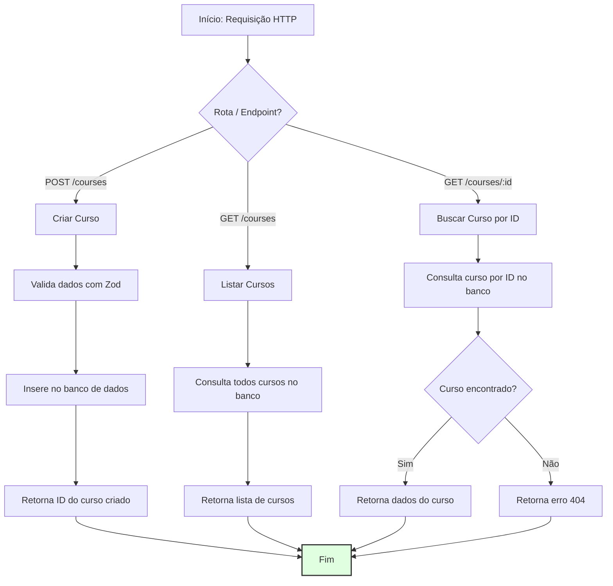

# API de Gerenciamento de Cursos

Uma API moderna em Node.js para gerenciar cursos, construída com Fastify, TypeScript e PostgreSQL.

## 🚀 Funcionalidades

- **API RESTful** para gerenciamento de cursos
- **TypeScript** para segurança de tipos
- **Fastify** como framework web de alta performance
- **PostgreSQL** como banco de dados com Drizzle ORM
- **Documentação OpenAPI/Swagger**
- **Suporte Docker** para configuração fácil de desenvolvimento
- **Zod** para validação de requisições e respostas

## 📋 Pré-requisitos

- Node.js (v18 ou superior)
- Docker e Docker Compose
- npm ou yarn

## 🛠️ Instalação

1. **Clone o repositório**

   ```bash
   git clone <url-do-repositório>
   cd dia2
   ```

2. **Instale as dependências**

   ```bash
   npm install
   ```

3. **Configure o banco de dados**

   ```bash
   # Inicie o PostgreSQL com Docker
   docker-compose up -d
   ```

4. **Execute as migrações do banco**

   ```bash
   npm run db:generate
   npm run db:migrate
   ```

5. **Crie o arquivo de ambiente**
   ```bash
   cp .env.example .env
   # Edite o .env com sua configuração do banco de dados
   ```

## 🚀 Executando a Aplicação

### Modo de Desenvolvimento

```bash
npm run dev
```

A API estará disponível em `http://localhost:3333`

### Gerenciamento do Banco de Dados

- **Gerar migrações**: `npm run db:generate`
- **Executar migrações**: `npm run db:migrate`
- **Abrir Drizzle Studio**: `npm run db:studio`

## 📚 Documentação da API

Quando o servidor estiver rodando, você pode acessar:

- **Swagger UI**: `http://localhost:3333/documentation`
- **Referência da API**: `http://localhost:3333/docs`

## 🔌 Endpoints da API

### Cursos

| Método | Endpoint       | Descrição              |
| ------ | -------------- | ---------------------- |
| `GET`  | `/courses`     | Listar todos os cursos |
| `GET`  | `/courses/:id` | Buscar curso por ID    |
| `POST` | `/courses`     | Criar um novo curso    |

### Exemplos de Requisição/Resposta

#### Criar Curso

```bash
POST /courses
Content-Type: application/json

{
  "title": "Fundamentos do Node.js",
  "description": "Aprenda os fundamentos do desenvolvimento Node.js"
}
```

#### Listar Cursos

```bash
GET /courses
```

#### Buscar Curso por ID

```bash
GET /courses/{id-do-curso}
```

## 🗄️ Schema do Banco de Dados

### Tabela de Cursos

- `id` (UUID, Chave Primária) - ID do curso gerado automaticamente
- `title` (Texto, Único, Não Nulo) - Título do curso (mínimo 5 caracteres)
- `description` (Texto, Opcional) - Descrição do curso

### Tabela de Usuários

- `id` (UUID, Chave Primária) - ID do usuário gerado automaticamente
- `name` (Texto, Não Nulo) - Nome do usuário
- `email` (Texto, Não Nulo, Único) - Email do usuário

## 🏗️ Estrutura do Projeto

```
dia2/
├── src/
│   ├── database/
│   │   ├── client.ts      # Conexão com o banco de dados
│   │   └── schema.ts      # Definições do schema do banco
│   └── routes/
│       ├── create-course.ts
│       ├── get-course-by-id.ts
│       └── get-courses.ts
├── drizzle/               # Migrações do banco de dados
├── docker-compose.yml     # Configuração do container PostgreSQL
├── server.ts             # Ponto de entrada principal da aplicação
└── package.json
```

## 🛠️ Tecnologias Utilizadas

- **Runtime**: Node.js
- **Framework**: Fastify
- **Linguagem**: TypeScript
- **Banco de Dados**: PostgreSQL
- **ORM**: Drizzle ORM
- **Validação**: Zod
- **Documentação**: Swagger/OpenAPI
- **Containerização**: Docker

## 🔧 Desenvolvimento

### Adicionando Novas Rotas

1. Crie um novo arquivo de rota em `src/routes/`
2. Exporte uma função `FastifyPluginAsyncZod`
3. Registre a rota em `server.ts`

### Alterações no Banco de Dados

1. Modifique o schema em `src/database/schema.ts`
2. Gere uma nova migração: `npm run db:generate`
3. Aplique a migração: `npm run db:migrate`

## 🗺️ Fluxo Principal da Aplicação


# api-fastify
# api-fastify
