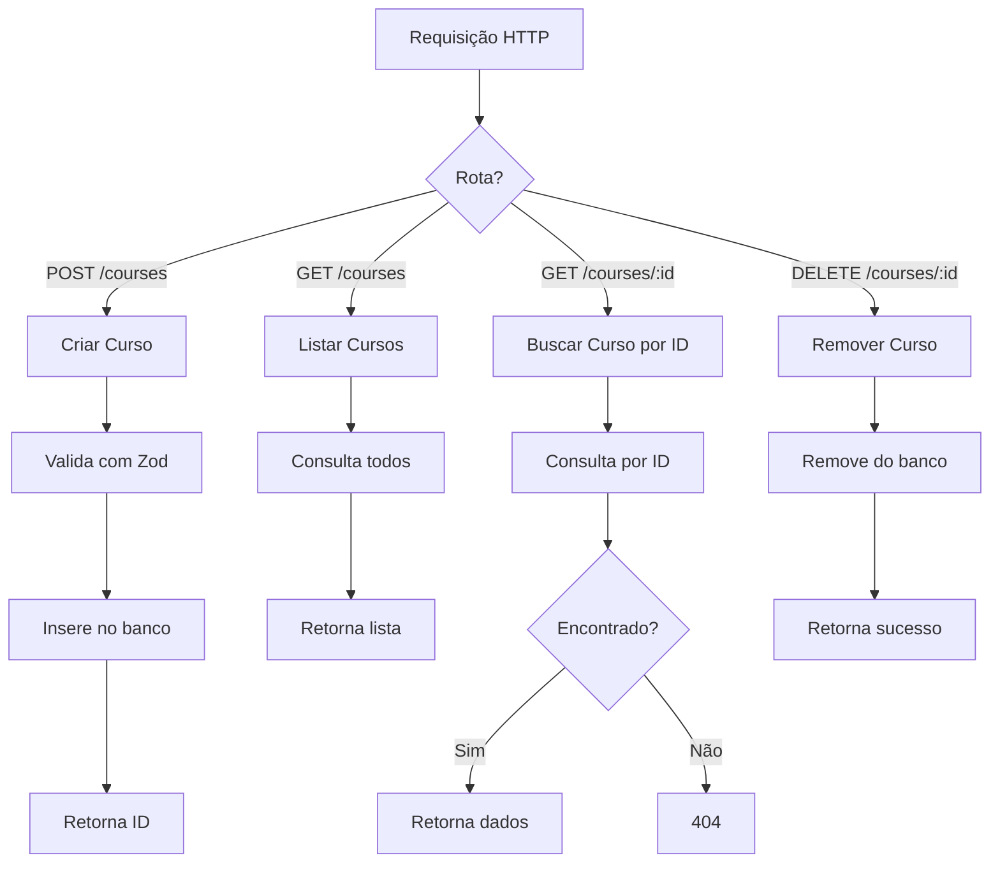

# API de Gerenciamento de Cursos

Uma API moderna desenvolvida em Node.js para gerenciar cursos, utilizando Fastify, TypeScript, PostgreSQL e Drizzle ORM.

---

## 🚀 Funcionalidades

- API RESTful para gerenciamento de cursos
- Segurança de tipos com TypeScript
- Fastify para alta performance
- Banco de dados PostgreSQL com Drizzle ORM
- Documentação automática via OpenAPI/Swagger
- Validação de dados com Zod
- Suporte a Docker para desenvolvimento e produção

---

## 📋 Pré-requisitos

- Node.js (v18 ou superior)
- Docker e Docker Compose
- npm ou yarn

---

## 🛠️ Instalação e Configuração

1. **Clone o repositório**

   ```bash
   git clone https://github.com/PedroCavalcantep/api-fastify.git
   cd Rocket/api
   ```

2. **Instale as dependências**

   ```bash
   npm install
   ```

3. **Configure o ambiente**

   ```bash
   cp .env.example .env
   # Edite o arquivo .env conforme necessário
   ```

4. **Suba o banco de dados com Docker**

   ```bash
   docker-compose up -d
   ```

5. **Gere e execute as migrações**
   ```bash
   npm run db:generate
   npm run db:migrate
   ```

---

## 🚦 Como rodar a aplicação

### Modo de desenvolvimento

```bash
npm run dev
```

Acesse: [http://localhost:3333](http://localhost:3333)

---

## 📚 Documentação da API

- **Swagger UI:** [http://localhost:3333/documentation](http://localhost:3333/documentation)
- **Referência da API:** [http://localhost:3333/docs](http://localhost:3333/docs)

---

## 🔌 Endpoints principais

| Método | Endpoint     | Descrição              |
| ------ | ------------ | ---------------------- |
| GET    | /courses     | Lista todos os cursos  |
| GET    | /courses/:id | Busca curso por ID     |
| POST   | /courses     | Cria um novo curso     |
| DELETE | /courses/:id | Remove um curso por ID |

### Exemplos

**Criar curso**

```http
POST /courses
Content-Type: application/json

{
  "title": "Fundamentos do Node.js",
  "description": "Aprenda os fundamentos do desenvolvimento Node.js"
}
```

**Listar cursos**

```http
GET /courses
```

**Buscar curso por ID**

```http
GET /courses/{id}
```

**Remover curso**

```http
DELETE /courses/{id}
```

---

## 🗄️ Schema do Banco de Dados

### Tabela de Cursos (`courses`)

- `id` (UUID, PK) - Gerado automaticamente
- `title` (Texto, Único, Não Nulo) - Título do curso (mín. 5 caracteres)
- `description` (Texto, Opcional) - Descrição do curso

### Tabela de Usuários (`users`)

- `id` (UUID, PK) - Gerado automaticamente
- `name` (Texto, Não Nulo) - Nome do usuário
- `email` (Texto, Não Nulo, Único) - Email do usuário

---

## 🏗️ Estrutura do Projeto

```
api/
├── src/
│   ├── database/
│   │   ├── client.ts
│   │   ├── schema.ts
│   │   └── seed.ts
│   └── routes/
│       ├── create-course.ts
│       ├── get-course-by-id.ts
│       ├── get-courses.ts
│       └── delete-course.ts
├── drizzle/
│   └── <migrações do banco>
├── docker-compose.yml
├── server.ts
├── app.ts
└── package.json
```

---

## 🛠️ Tecnologias Utilizadas

- **Node.js** (runtime)
- **Fastify** (framework web)
- **TypeScript** (linguagem)
- **PostgreSQL** (banco de dados)
- **Drizzle ORM** (mapeamento objeto-relacional)
- **Zod** (validação de dados)
- **Swagger/OpenAPI** (documentação)
- **Docker** (containerização)

---

## 🔧 Desenvolvimento

### Adicionando novas rotas

1. Crie um novo arquivo em `src/routes/`
2. Exporte uma função do tipo `FastifyPluginAsyncZod`
3. Registre a rota em `server.ts`

### Alterando o banco de dados

1. Modifique o schema em `src/database/schema.ts`
2. Gere uma nova migração:
   ```bash
   npm run db:generate
   ```
3. Aplique a migração:
   ```bash
   npm run db:migrate
   ```

---

## 🗺️ Fluxo da Aplicação



